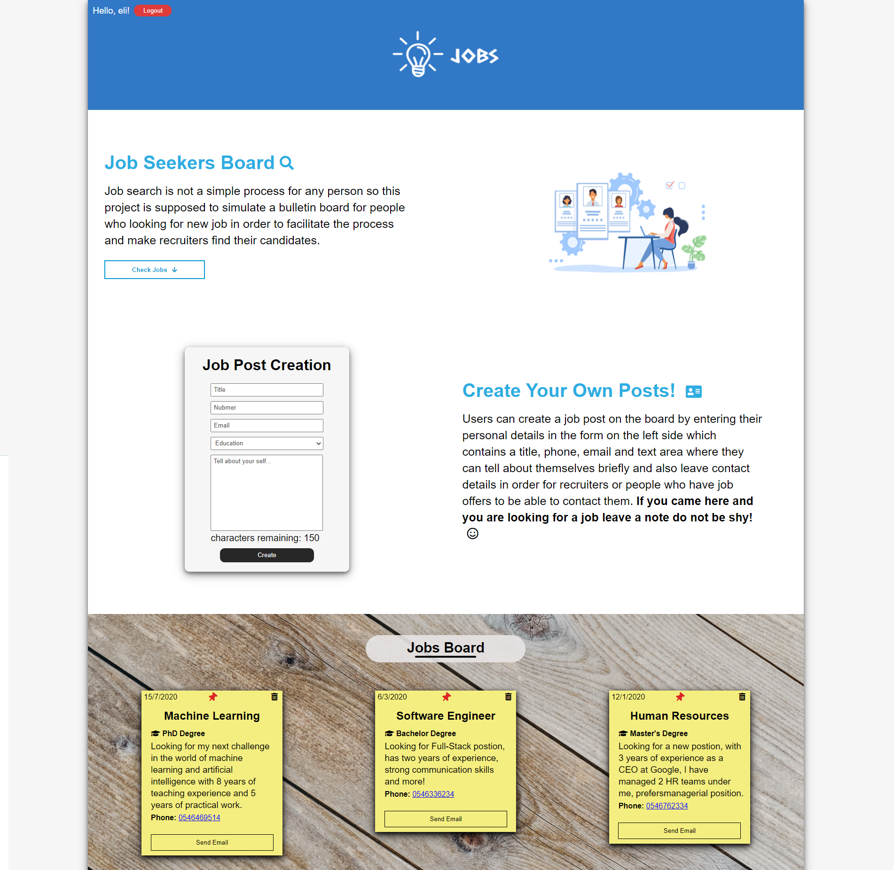

# Job-Posts
Full stack web application that simulates a bulletin board for people who looking for new job in order to facilitate the process and make recruiters find their candidates. After authentication users will be able create and delete their posts.

**Live Demo:** https://job-posts.netlify.app/

### Technologies
* Angular on the Frontend
* NodeJS & Express on the Backend
* MySQL Database
* Responsive Web Design
* Typescript
